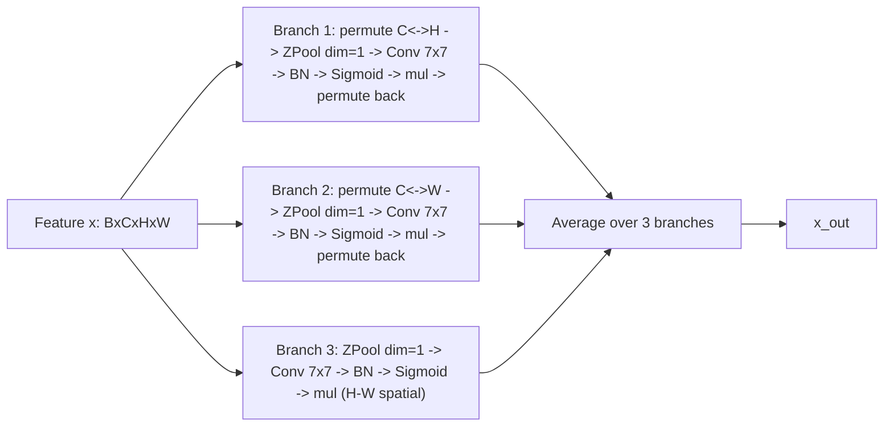
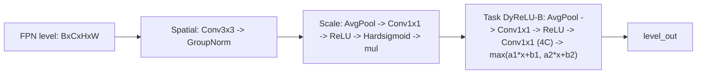

# CHANGELOG — `TDW` (Triplet + DyHead + WIoU v3)

> Branch: `feat/tdw`
> Base: `feat/dyhead-wiou` (DyHead head + WIoU v3 loss)
> Cherry-pick from `feat/triplet`: `b53004af0` (TripletAttention module) + `69a3bde2d` (yolo11-td.yaml backbone with Triplet at P5 end)
> Created: 2026-06-05

## 1. Goal

Combine all three ablation modules in one model:

- `+T` (Triplet Attention): inserted at end of P5 backbone (before SPPF) — see `yolo11-td.yaml` line 30.
- `+D` (DyHeadDetect): replaces final `Detect` with cascaded spatial / scale / task-aware DyHead blocks per FPN level.
- `+W` (Wise-IoU v3): replaces CIoU in `BboxLoss` via `--iou wiou`.

No new yaml needed — TDW reuses `yolo11-td.yaml` (which already has Triplet inserted between C3k2 and SPPF at P5 end + DyHeadDetect head). The only change vs `+TD` is the loss switch.

## 2. Network architecture (TDW = yolo11-td.yaml + WIoU)

### 2.1 Block-level diagram

```mermaid
flowchart LR
    Input["Input 640x640x3"] --> P1["Conv P1/2"]
    P1 --> P2["Conv P2/4"]
    P2 --> C3k2_2["C3k2"]
    C3k2_2 --> P3conv["Conv P3/8"]
    P3conv --> C3k2_4["C3k2 layer 4 (P3 src)"]
    C3k2_4 --> P4conv["Conv P4/16"]
    P4conv --> C3k2_6["C3k2 layer 6 (P4 src)"]
    C3k2_6 --> P5conv["Conv P5/32"]
    P5conv --> C3k2_8["C3k2 layer 8"]
    C3k2_8 --> Triplet["TripletAttention layer 9 (NEW vs baseline)"]
    Triplet --> SPPF["SPPF layer 10"]
    SPPF --> C2PSA["C2PSA layer 11 (P5 src)"]

    C2PSA --> Up1["Upsample x2"]
    Up1 --> Cat_P4["Concat with P4 src"]
    C3k2_6 --> Cat_P4
    Cat_P4 --> C3k2_14["C3k2 layer 14"]
    C3k2_14 --> Up2["Upsample x2"]
    Up2 --> Cat_P3["Concat with P3 src"]
    C3k2_4 --> Cat_P3
    Cat_P3 --> C3k2_17["C3k2 layer 17 (P3 out)"]

    C3k2_17 --> Down1["Conv stride 2"]
    Down1 --> Cat_P4d["Concat with C3k2_14"]
    C3k2_14 --> Cat_P4d
    Cat_P4d --> C3k2_20["C3k2 layer 20 (P4 out)"]
    C3k2_20 --> Down2["Conv stride 2"]
    Down2 --> Cat_P5d["Concat with C2PSA"]
    C2PSA --> Cat_P5d
    Cat_P5d --> C3k2_23["C3k2 layer 23 (P5 out)"]

    C3k2_17 --> DyHead["DyHeadDetect layer 24 (NEW vs baseline) - per-level: spatial -> scale -> task DyReLU-B"]
    C3k2_20 --> DyHead
    C3k2_23 --> DyHead

    DyHead --> Loss["Loss = BboxLoss (WIoU v3, NEW vs baseline) + cls + dfl"]
```



Three changes vs YOLOv11n baseline:

1. **Backbone**: `TripletAttention` inserted between `C3k2` (layer 8) and `SPPF` (layer 10) at the end of the P5 stage. Channel count unchanged (1024 at scale n -> 256 after width=0.25 multiplier).
2. **Head**: `Detect` -> `DyHeadDetect`. Each P3/P4/P5 level gets its own `DyHeadBlock` (spatial 3x3 Conv+GroupNorm -> scale gate -> task-aware DyReLU-B).
3. **Loss**: CIoU -> WIoU v3 (distance-attention reweighting + monotonic focal mechanism on outlier boxes).

### 2.2 Triplet Attention internals (block at layer 9)



- Branches 1 & 2 model **cross-dimension** interactions (C<->H, C<->W) — these are channel-spatial mixed but cheap (each branch reduces to 2 channels via Z-Pool then 7x7 conv).
- Branch 3 is a **pure spatial** H-W attention (the same kind of attention DyHead's spatial-aware step also performs).
- Switch `no_spatial=True` -> drop branch 3, keep only the two cross-dim branches; this is the "channel-only" variant explored in §6.

### 2.3 DyHeadBlock internals (per FPN level)



A separate `DyHeadBlock` is instantiated for each of P3/P4/P5 (channels differ), no weight sharing.

## 3. Training command (autodl)

```bash
ssh autodl 'cd /root/autodl-tmp/ultralytics && \
  source /root/miniconda3/etc/profile.d/conda.sh && conda activate base && \
  tmux new-session -d -s t_train_tdw && \
  tmux set-option -t t_train_tdw remain-on-exit on && \
  tmux send-keys -t t_train_tdw "cd /root/autodl-tmp/ultralytics && \
    source /root/miniconda3/etc/profile.d/conda.sh && conda activate base && \
    python train_variant.py \
      -c ultralytics/cfg/models/11/yolo11-td.yaml \
      --iou wiou \
      -n TDW \
      --epochs 300 \
      --device 0 2>&1 | tee runs/TDW_train.log; echo EXITCODE=\$?" C-m'
```

## 4. Files (vs feat/dyhead-wiou base)

Cherry-picked from `feat/triplet`:

| File | Source commit | Notes |
|---|---|---|
| `ultralytics/nn/modules/conv.py` | `b53004af0` | adds `ZPool`, `AttentionGate`, `TripletAttention` |
| `ultralytics/nn/modules/__init__.py` | `b53004af0` | exports `TripletAttention` |
| `ultralytics/nn/tasks.py` | `b53004af0` | imports + `parse_model` branch for `TripletAttention` |
| `ultralytics/cfg/models/11/yolo11-td.yaml` | `69a3bde2d` | backbone with Triplet at P5 end + DyHeadDetect head |

WIoU and DyHead changes already live in `feat/dyhead-wiou` base.

## 5. Results (2026-06-05)

Trained 300/300 epochs (no early stop), 1.835 h on RTX 4090, AutoBatch=46. best.pt = best of run.

| Metric | Value |
|---|---|
| Precision | 86.8% |
| Recall | 80.8% |
| mAP50 | 86.5% |
| mAP50-95 | 60.9% |
| FPS (batch=1) | not measured this round |
| GFLOPs | 9.29 (fused 9.4) |
| Params (M) | 4.36 |

### 5.1 Per-class (best.pt)

| Class | Images | Instances | P | R | mAP50 | mAP50-95 |
|---|---:|---:|---:|---:|---:|---:|
| all          | 1411 | 65255 | 0.868 | 0.808 | 0.865 | 0.609 |
| Car          | 1408 | 18342 | 0.906 | 0.909 | 0.964 | 0.793 |
| Truck        |  595 |   660 | 0.752 | 0.931 | 0.793 | 0.537 |
| Van          |  849 |  1385 | 0.821 | 0.703 | 0.822 | 0.690 |
| Bus          |  496 |   669 | 0.946 | 0.916 | 0.951 | 0.784 |
| Cyclist      | 1238 |  3469 | 0.876 | 0.804 | 0.885 | 0.603 |
| Motorcyclist | 1121 |  3632 | 0.829 | 0.624 | 0.775 | 0.513 |
| Pedestrian   | 1228 |  5073 | 0.861 | 0.719 | 0.806 | 0.451 |
| Trafficcone  | 1411 | 32025 | 0.952 | 0.863 | 0.926 | 0.502 |

### 5.2 Comparison vs all 7 prior variants

| Variant | P | R | mAP50 | mAP50-95 | GFLOPs | Params(M) |
|---|---:|---:|---:|---:|---:|---:|
| baseline (n) | — | — | 0.857 | 0.601 | 6.4 | 2.60 |
| `+T`  | 0.856 | 0.805 | 0.859 | 0.602 | 6.4 | 2.60 |
| `+D`  | 0.863 | 0.811 | 0.866 | 0.613 | 9.3 | 4.35 |
| `+W`  | 0.864 | 0.803 | 0.860 | 0.602 | 6.4 | 2.60 |
| `+TD` | 0.858 | 0.810 | 0.862 | 0.610 | 9.29 | 4.36 |
| `+TW` | 0.858 | 0.810 | 0.863 | 0.605 | 6.4 | 2.58 |
| **`+DW`** | **0.860** | **0.819** | **0.870** | **0.613** | 9.3 | 4.35 |
| `TDW` | 0.868 | 0.808 | 0.865 | 0.609 | 9.29 | 4.36 |

### 5.3 Key observations

- **TDW does NOT beat `+DW`** (mAP50 -0.5, mAP50-95 -0.4 at the same parameter / FLOP budget).
- TDW's per-class breakdown vs `+DW` shows the regression is concentrated on **Cyclist / Motorcyclist / Pedestrian / Trafficcone** (small / occlusion-prone classes), while large vehicles (Car / Bus) are roughly unchanged. This contradicts the original premise that Triplet's cross-dimension attention should help small / occluded targets.
- Cross-check with `+TD` vs `+D`: Triplet on top of DyHead also costs -0.3 mAP50-95. Two independent runs (with and without WIoU) give the **same direction** -> the loss is from the architectural interaction, not optimization noise.
- `+DW` Recall 0.819 vs TDW Recall 0.808: Triplet at P5 end appears to reduce recall by ~1 point when DyHead is also active. Since both DyHead's spatial-aware step and Triplet's H-W branch are spatial gates over feature maps, hypothesis: **double spatial attention in the feed-forward path over-suppresses weakly-activated regions** that DyHead would otherwise rescue with its task-aware DyReLU-B.

## 6. Follow-up: alternative TDW configurations under consideration

Two hypotheses raised after this round (not yet executed):

### 6.1 Channel-only Triplet (`no_spatial=True`)

- **Change**: pass `no_spatial=True` to `TripletAttention` constructor at layer 9 of `yolo11-td.yaml`.
- **Mechanism**: drops the H-W branch (branch 3 in §2.2). Keeps only C<->H and C<->W cross-dimension branches.
- **Rationale**: removes the redundancy with DyHead's spatial-aware Conv3x3+GN gate. If the regression in §5.3 is caused by spatial attention double-application, this should recover.
- **Cost**: ~30% fewer Triplet params (drops one 7x7 conv + BN), inference path slightly shorter. Negligible at TDW scale.

### 6.2 Triplet at P3/P4 instead of P5

- **Change**: new `yolo11-tdw-p3p4.yaml`. Move `TripletAttention` to end of layer 4 (P3 source) and/or layer 6 (P4 source) instead of layer 9 (P5 end). DyHead unchanged.
- **Mechanism**: applies Triplet earlier where small-object signal still exists at higher spatial resolution, before P5 downsample destroys it.
- **Rationale**: P5 (20x20) cannot help Pedestrian/Cyclist localization much; Triplet should attend at P3 (80x80) or P4 (40x40) where these classes are still resolvable.
- **Risk**: more compute (Triplet at 80x80/40x40 vs 20x20 -> 16x or 4x the spatial footprint of branch 3). Need to recompute GFLOPs.

### 6.3 Decision pending

Section §7 will be appended after the next round of training is decided and run.

